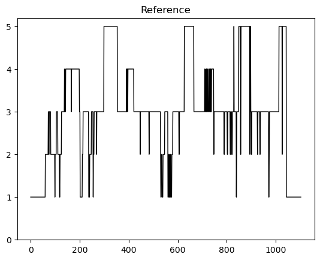
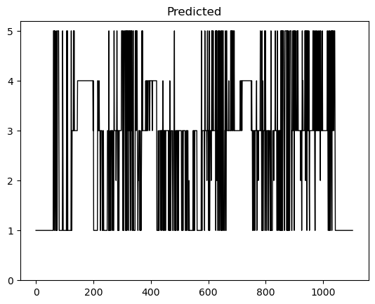

# 作業ログ

- [作業ログ](#作業ログ)
  - [8/3](#83)
    - [✅mneの環境構築(MacOS上)](#mneの環境構築macos上)
    - [✅MNEが使えることを確認](#mneが使えることを確認)
    - [✅睡眠ステージの段階分類（サンプル）](#睡眠ステージの段階分類サンプル)
    - [❌EDFBrowserのダウンロード](#edfbrowserのダウンロード)
    - [メモ](#メモ)
    - [次回](#次回)
  - [8/12](#812)
    - [mneの使い方](#mneの使い方)
    - [✅データの可視化](#データの可視化)
    - [yasaを試す](#yasaを試す)
    - [メモ](#メモ-1)

## 8/3

### ✅mneの環境構築(MacOS上)

conda → miniforge(conda-forgeがデフォのやつらし)

```zsh
conda -n mne python=3.9 mne-base jupyter notebook
```

[MNE-Pythonインストール方法](https://mne.tools/stable/install/manual_install.html)

### ✅MNEが使えることを確認

[MEG/EEG分析チュートリアル](https://mne.tools/stable/auto_tutorials/intro/10_overview.html)

### ✅睡眠ステージの段階分類（サンプル）

[PSGデータから睡眠段階表示を行う(チュートリアル)](https://mne.tools/stable/auto_tutorials/clinical/60_sleep.html)

PSG: 睡眠ポリグラフ検査（PSG）は，脳波，顎筋電図，眼球運動，気流，呼吸運動，動脈血酸素飽和度，心電図，前脛骨 筋筋電図などを終夜にわたり同時に記録する。

Hypnogram: 睡眠の段階を時間の関数として表すグラフ(**これを作る**)

Epochs: 

### ❌EDFBrowserのダウンロード

[EDFBrowser](https://www.teuniz.net/edfbrowser/)

```zsh
brew install git qt # gitとQt6が必要
cd ./Desktop && mkdir EDFB && cd EDFB # 臨時ディレクトリ
git clone https://gitlab.com/Teuniz/EDFbrowser.git # EDFBrowserのGitリポジトリをダウンロード
cd EDFbrowser # EDFBrowserのディレクトリに移動
qmake # qmakeを実行
make # makeを実行
```

クローンしたコードが古いもので、Qt6に対応してなかった。
修正にはファイル検索をして、インクルードパスを直す必要があった。

検索の仕方

```zsh
cd /opt/homebrew/Cellar/qt/6.3.1_1/lib
find ./ -name "hoge"
```

### メモ

[Python-EEG工具库MNE中文教程(5)-机器学习算法随机森林判断睡眠类型](https://cloud.tencent.com/developer/article/1543743)

[Python-EEG工具库MNE中文教程](https://cloud.tencent.com/developer/search/article-Python-EEG工具库MNE中文教程)

[EEG与睡眠分期](https://cloud.tencent.com/developer/article/1654054)

睡眠ステージ分類はyasa使った方が楽かもしれない → [リンク](https://raphaelvallat.com/yasa/build/html/quickstart.html)

### 次回

MNEの理解を深める
余裕があったらyasaを試してみる

---

## 8/12

### mneの使い方

```python
mne.datasets.sleep_physionet.age.fetch_data(subjects, recording)
```

-> subjects: list of subject IDs(0-82), except(39,68,69,78,79)
-> recording: list of recording IDs(1, 2), except(1, (36, 52)), (2, 13).

```python
epochs_test = mne.Epochs(raw=raw_test, events=events_test, event_id=event_id, tmin=0., tmax=tmax, baseline=None)
```

-> hypnogram

### ✅データの可視化

元データとscikitによる予測データをグラフ化





Accuracy: 64.1%

### yasaを試す


### メモ

[Sleep Stage Classification from Single Channel EEG using Convolutional Neural Networks](https://towardsdatascience.com/sleep-stage-classification-from-single-channel-eeg-using-convolutional-neural-networks-5c710d92d38e)

---